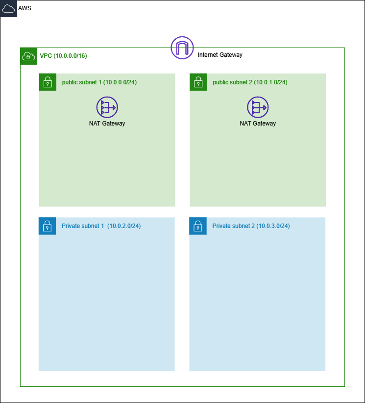
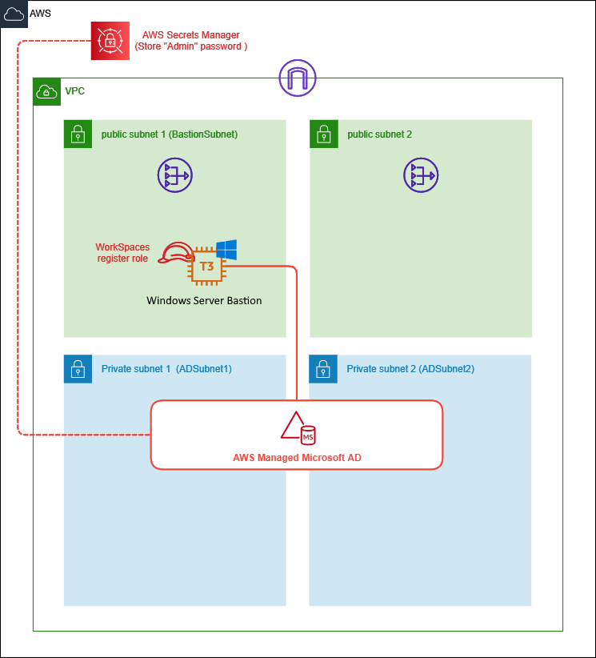

# Amazon WorkSpaces Microsoft AD Stack

ID基盤にAWS Managed Microsoft ADを使用してAmazon WorkSpacesを試すためのCloudFormation Templateを公開します。  

## アーキテクチャ


VPCに2つのPublic SubnetとPrivate Subnetを作成し、Private SubnetにAWS Managed Microsoft ADとWorkSpaces環境、Public SubnetにActive Direcotry管理用の踏み台サーバーを構築します。

踏み台サーバーではCLI(AWS Tools for PowerShell)によるWorkSpacesの登録を行える様にWorkSpacesへのアクセス権限をもつIAMロールをアタッチしてます。  
このロールは初期導入時に利用されます。  

## 導入手順

このスタックでは

- ネットワークの構築
- AWS Managed Microsoft AD、踏み台サーバーの構築

で2つにテンプレートを分けています。  
これはAWS Managed Microsoft ADの構築に時間がかかるため1つのテンプレートではデバッグが困難であったのと、テンプレートの分離により再利用性を高める意図があります。  

### 0. 事前準備

本テンプレートを導入する前に以下の点を準備しておいてください。

* EC2キーペアの用意
    * CloudFormationスタック作成時にキーペア名を指定する必要があります。
    * キーペアは既存のものを利用する、新規に作成するどちらでも構いません。

### 1. ネットワーク用スタックの作成

CloudFormationテンプレート [WorkSpaces-Network.yaml](./WorkSpaces-Network.yaml) を使いスタックを作成してください。  
指定パラメーターは以下の通りです。  

|パラメーター名|説明|デフォルト値|備考|
|----|----|----|----|
|SystemName|各リソースに付けるシステム名|wsmsad|各リソースは <システム名>-<環境名>-<リソース名>で命名されます|
|EnvironmentName|各リソースに付ける環境名|prd|各リソースは <システム名>-<環境名>-<リソース名>で命名されます|
|AZ1|各種リソースを配備する1つめのAvailability Zone名|-||
|AZ2|各種リソースを配備する2つめのAvailability Zone名|-||
|VPCCIDR|作成するVPCのCIDR|10.0.0.0/16||
|PublicSubnet1CIDR|AZ1のPublic SubnetのCIDR|10.0.0.0/24|VPCCIDRおよび他のSubnetと矛盾の無い様にしてください|
|PublicSubnet2CIDR|AZ2のPublic SubnetのCIDR|10.0.1.0/24|　〃（同上）　|
|PrivateSubnet1CIDR|AZ1のPrivate SubnetのCIDR|10.0.2.0/24|　〃（同上）　|
|PrivateSubnet2CIDR|AZ2のPrivate SubnetのCIDR|10.0.3.0/24|　〃（同上）　|

このスタックにより

* VPCをはじめとしたネットワークスタックの作成

が行われ下図の様な構成が作成されます。



### 2. AWS Managed Microsoft AD用スタックの作成

CloudFormationテンプレート [WorkSpaces-MicrosoftAD.yaml](./WorkSpaces-MicrosoftAD.yaml) を使いスタックを作成してください。  
指定パラメーターは以下の通りです。  

|パラメーター名|説明|デフォルト値|備考|
|----|----|----|----|
|SystemName|各リソースに付けるシステム名|wsmsad|各リソースは <システム名>-<環境名>-<リソース名>で命名されます|
|EnvironmentName|各リソースに付ける環境名|prd|各リソースは <システム名>-<環境名>-<リソース名>で命名されます|
|VPCID|リソースを配備するVPCのID|-||
|BastionSubnetID|踏み台サーバーを配備するSubnetのID|-|必ずPublic Subnetにしてください|
|ADSubnetID1|AWS Managed Microsoft ADを配備する1つめのSubnet ID|-||
|ADSubnetID2|AWS Managed Microsoft ADを配備する2つめのSubnet ID|-|ADSubnetID1とは異なるSubnetにしてください|
|BastionKeyPairName|踏み台サーバーで使用するキーペア名|-|キーペアは事前に作成しておいてください|
|BastionAmi|踏み台サーバーのAMI|/aws/service/ami-windows-latest/Windows_Server-2025-Japanese-Full-Base|英語OS : /aws/service/ami-windows-latest/Windows_Server-2025-English-Full-Base も利用可能|
|MaintenanceCIDR|踏み台サーバーに接続可能なCIDR|203.0.113.1/32|ここで指定したCIDRからのみRDP接続できます|
|MSADEdition|AWS Managed Microsoft ADのエディション|Standard|StandardかEnterpriseから選択|
|DomainDNSName|作成するActive DirectoryのDNS名|corp.contoso.com||
|DomainNetBIOSName|作成するActive DirectoryのNetBIOS名|corp||

このスタックにより

* AWS Managed Microsoft AD
* AWS Managed Microsoft ADの管理者ユーザーのパスワードを格納したシークレット (AWS Secrets Managerを使用)
* 踏み台サーバー
    * 踏み台サーバーはActive Directoryに自動参加

が作成されます。 



この時点でWorkSpacesとディレクトリ環境の紐づけは行われていません。  
紐づけは次の手順で行います。

#### 補足 : 踏み台サーバーへのログイン

このテンプレートでは踏み台サーバーの構築と同時にActive Directoryに参加します。  
踏み台サーバーへはローカルAdministratorかAWS Managed Microsoft ADの管理者ユーザー(`Admin`)でRDP接続可能です。  

AWS Managed Microsoft ADの管理者ユーザー(`Admin`)の初期パスワードはランダムな値が自動生成されAWS Secrets Managerのシークレットとして保存されています。  

* <システム名>-<環境名>-msad-admin-initial-password

という名前のシークレットが作成されますので、`password`キーの値を参照してログインに利用してください。  

### 3. WorkSpaces への紐づけ

作成したAWS Managed Microsoft ADをWorkSpacesと紐づけます。  
踏み台サーバーにログインしてPowerShellコンソールを起動し、`C:\WorkSpacesTools\01-register-workspacesdirectory.ps1` を実行します。  
エラー無く処理が完了すればWorkSpacesへの紐づけは完了です。  

```powershell
# 実行例
PS C:\Users\Admin> C:\WorkSpacesTools\01-register-workspacesdirectory.ps1
workspaces_DefaultRole role is already exists. Skip creating workspaces_DefaultRole...
2021/08/20 8:40:48 : Register WorkSpaces...
2021/08/20 8:40:50 : Registration complete!
```

これですべての手順は完了です。  
あとは自由にWorkSpacesを試してください。  

## 削除手順

WorkSpacesの使用を止める場合は以下の手順を実施します。  

### 0. 事前準備

予め全てのWorkSpaceを削除しておいてください。  

### 1. WorkSpaces との紐づけ解除

踏み台サーバーにログインしてください。  

PowerShellコンソールを起動し、`C:\WorkSpacesTools\99-unregister-workspacesdirectory.ps1` を実行します。  
エラー無く処理が完了すればWorkSpacesへの紐づけは解除されます。  

```powershell
# 実行例
PS C:\Users\Admin> C:\WorkSpacesTools\99-unregister-workspacesdirectory.ps1
2021/08/20 8:41:13 : Unregister WorkSpaces...
2021/08/20 8:41:13 : Unregistration Complete.
---------------------------------------------------------------------
If you want to remove workspaces_DefaultRole, please remove manually.
---------------------------------------------------------------------
```

WorkSpaces作成時に作成される`workspaces_DefaultRole`に関しては不要であれば手動で消してください。本テンプレートで削除することはありません。  

### 2. CloudFormation スタックの削除

最後に作成したCloudFormationスタックをすべて削除します。

- AWS Managed Microsoft AD用スタック
- ネットワーク用スタック

の順で削除してください。  
これで全てのリソースが削除されます。  