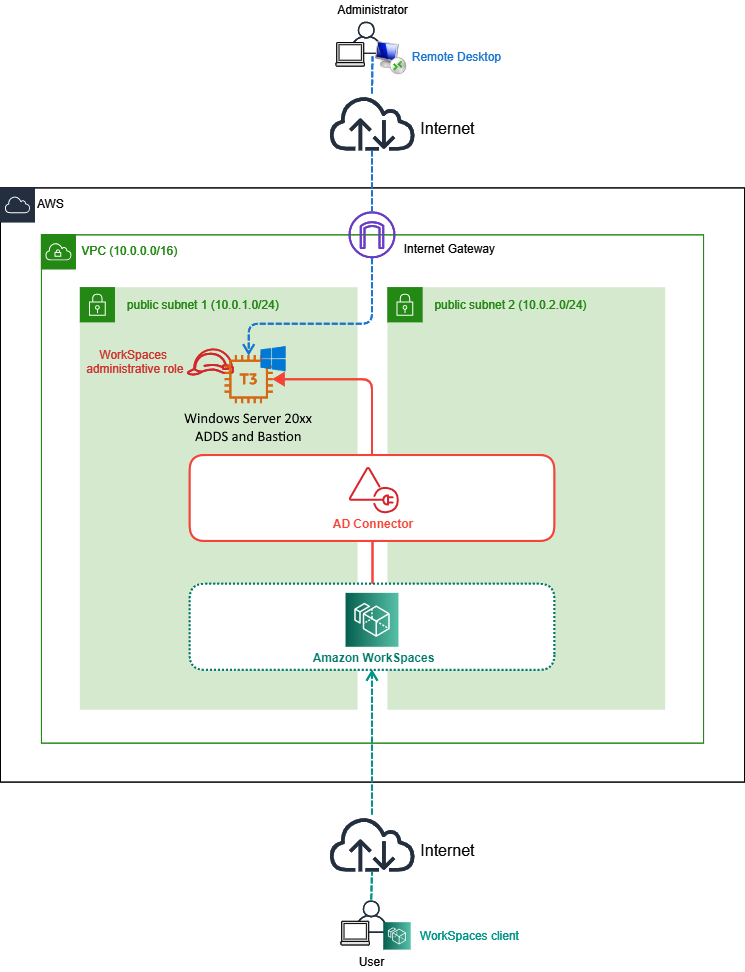

# Amazon WorkSpaces Trial Stack

最小構成でAmazon WorkSpacesを試すためのCloudFormation Templateを公開します。  

## アーキテクチャ



`10.0.0.0/16`のVPCに2つのPublic Subnet(`10.0.1.0/24`, `10.0.2.0/24`)を作成、その中にドメインコントローラー兼踏み台サーバーとなるWindows Server 2022 EC2インスタンスを1台、AD Connector、WorkSpacesを配置する構成となります。 

EC2インスタンスではCLI(AWS Tools for PowerShell)によるWorkSpacesの管理も行える様にWorkSpacesの管理者相当の権限をもつIAMロールをアタッチしてます。  
このロールは初期導入時にも利用されます。    

### 想定リージョン

このテンプレートは東京リージョン(`ap-northeast-1`)とWorkSpacesの価格が安いバージニア北部(`us-east-1`)で動作確認をしています。  
WorkSpacesはリージョン毎でサポートされるAvailability IDが決まっているため

* 東京 : apne1-az1, apne1-az4
* バージニア北部 : use1-az2, use1-az4, use1-az6

からいずれか2つを指定してください。

* 参考 : [Availability Zones for Amazon WorkSpaces](https://docs.aws.amazon.com/workspaces/latest/adminguide/azs-workspaces.html)

なお、アカウント毎でAvailablity Zoneの名前とIDの紐づけは異なるので適宜確認してください。  
例えばAWS CLIからだと以下のコマンドで確認できます。  

```bash
# AWS CLIの aws ec2 describe-availability-zones を使うとAvailablity Zone IDを参照できる
aws ec2 describe-availability-zones --query 'sort_by(AvailabilityZones, &ZoneId)[].{ZoneId:ZoneId, ZoneName:ZoneName}' --output table
```

CloudShellでコマンドを実行すると良いでしょう。  

```bash
# 実行例
#
# ※ 結果はアカウント毎で異なります ※
#
$ aws ec2 describe-availability-zones --query 'sort_by(AvailabilityZones, &ZoneId)[].{ZoneId:ZoneId, ZoneName:ZoneName}' --output table
----------------------------------
|    DescribeAvailabilityZones   |
+------------+-------------------+
|   ZoneId   |     ZoneName      |
+------------+-------------------+
|  apne1-az1 |  ap-northeast-1c  |
|  apne1-az2 |  ap-northeast-1d  |
|  apne1-az4 |  ap-northeast-1a  |
+------------+-------------------+

$ aws ec2 describe-availability-zones --query 'sort_by(AvailabilityZones, &ZoneId)[].{ZoneId:ZoneId, ZoneName:ZoneName}' --region us-east-1 --output table
----------------------------
| DescribeAvailabilityZones|
+-----------+--------------+
|  ZoneId   |  ZoneName    |
+-----------+--------------+
|  use1-az1 |  us-east-1b  |
|  use1-az2 |  us-east-1c  |
|  use1-az3 |  us-east-1e  |
|  use1-az4 |  us-east-1d  |
|  use1-az5 |  us-east-1f  |
|  use1-az6 |  us-east-1a  |
+-----------+--------------+
```

## :warning: 構成上の注意点 :warning:

本テンプレートでは簡易にWorkSpacesを試すためにいくつか本番環境では推奨されない構成を採っています。  
このため本テンプレートを本番環境で使わないでください。  

### 1. ネットワーク構成上の問題

本テンプレートでは構成を簡素にするため2つのPublic Subnetに全てのサービスを構成しています。  
一般的にはWorkSpacesを構成する要素はPrivate Subnetに構成することが多いです。  

* 構成例
    * [AWS ソリューション構成例 - 仮想デスクトップ (VDI)](https://aws.amazon.com/jp/cdp/vdi/)
    * [Amazon WorkSpacesを活用して直近のテレワーク需要の急場を凌ぐ](https://dev.classmethod.jp/articles/workspaces-internetaccess-via-natgw/)
    * [Azure AD Domain Servicesを使ってAzure ADユーザーでAmazon WorkSpacesを利用してみた](https://dev.classmethod.jp/articles/try-amazon-workspades-using-azure-ad-domain-services-directory/)
    * [WorkSpaces での Web フィルタリングを考えてみた](https://dev.classmethod.jp/articles/web-filtering-on-workspaces/)

### 2. Active Directory 構成上の問題

本テンプレートではドメインコントローラーを単一のEC2で稼働させていますが、通常ドメインコントローラーは複数のサブネットに2台数以上で冗長構成とすることが推奨されています。  
また、ドメインコントローラーと踏み台サーバーを兼務させていますがこれも非推奨の構成となります。  

### 3. AD Connector接続ユーザーの権限の問題

本テンプレートでは手順の簡素化のためAD Connectorに接続するユーザー`adconnector`を`Domain Admins`グループに所属させています。  
これは過剰な権限であり、以下のドキュメント・ブログに記載されている様に必要最低限の権限を与えることが推奨されています。

* [権限をサービスアカウントに委任する](https://docs.aws.amazon.com/ja_jp/directoryservice/latest/admin-guide/prereq_connector.html#connect_delegate_privileges)
* [Active Directory Connector(AD Connector)を試してみた](https://dev.classmethod.jp/articles/try-active-directory-connector/)

### 4. EC2インスタンスに与えられている権限の問題

本テンプレートでは踏み台サーバーとなるEC2からWorkSpacesの初期導入に関わる設定を行うため比較的強めの権限を持つIAMロールを与えています。  
本番環境では必要最低限の権限を与える様にしてください。  

* [Identity and Access Management for Amazon WorkSpaces](https://docs.aws.amazon.com/workspaces/latest/adminguide/workspaces-access-control.html)

## 導入手順

### 0. 事前準備

本テンプレートを導入する前に以下の点を準備しておいてください。

* EC2キーペアの用意
    * CloudFormationスタック作成時にキーペア名を指定する必要があります。
    * キーペアは既存のものを利用する、新規に作成するどちらでも構いません。

### 1. CloudFormationスタックの作成

CloudFormationテンプレート [WorkSpacesTrial.yaml](./WorkSpacesTrial.yaml) を使いスタックを作成してください。  
指定パラメーターは以下の通りです。  

|パラメーター名|説明|デフォルト値|備考|
|----|----|----|----|
|SystemName|各リソースに付けるシステム名|workspaces|各リソースは <システム名>-<環境名>-<リソース名>で命名されます|
|EnvironmentName|各リソースに付ける環境名|trial|各リソースは <システム名>-<環境名>-<リソース名>で命名されます|
|AZ1|Public Subnet1を配備するAvailability Zone名|-||
|AZ2|Public Subnet2を配備するAvailability Zone名|-||
|KeyPairName|EC2で使用するキーペア名|-|キーペアは事前に作成しておいてください|
|WindowsLatestAmi|EC2のAMI|/aws/service/ami-windows-latest/Windows_Server-2022-Japanese-Full-Base|英語OS : /aws/service/ami-windows-latest/Windows_Server-2022-English-Full-Base も利用可能|
|InstanceType|EC2のインスタンスタイプ|t3.medium|Windows Server 2025の場合は`m7i-flex.large`推奨|
|MaintenanceCIDR|EC2に接続可能なCIDR|1.2.3.4/32|ここで指定したCIDRからのみRDP接続できます|
|DomainDNSName|作成されるActive DirectoryのDNS名|corp.contoso.com||
|DomainNetBIOSName|作成されるActive DirectoryのNetBIOS名|corp||
|DomainSafeModePassword|ディレクトリサービス復元モード(DSRM)の管理者パスワード|P@ssword|複雑さの要件を満たす必要があります|
|ADConnectorPassword|AD Connector用ユーザー`adconnector`のパスワード|P@ssword|複雑さの要件を満たす必要があります|

このスタックにより

* VPCをはじめとしたネットワークスタックの作成
* EC2にアタッチするIAMロールの作成
* EC2の作成
    * EC2の初期化処理の中でActive Directoryドメインを構築
    * AD Connector接続用ユーザー `adconnector` を追加
    * テスト用ドメインユーザー `user01` - `user10` を追加
    * 後続処理のためのPowerShellスクリプトを自動生成

が行われます。  

### 2. AD Connectorの作成

作成されたEC2に`Administrator`ユーザーでログインしてください。  

PowerShellコンソールを起動し、`C:\WorkSpacesTools\01-cretate-adconnector.ps1` を実行します。  
エラー無く処理が完了すればAD Connectorが作成されます。  

```powershell
# 実行例
PS C:\> C:\WorkSpacesTools\01-cretate-adconnector.ps1
2020/11/04 5:45:39 : Start Creating AD Connector...
2020/11/04 5:46:48 : Waiting for Creation Complete...
2020/11/04 5:49:49 : Directory d-xxxxxxxxxx is created!
```

#### 注意事項

AD Connectorの作成後、そのディレクトリIDが`C:\WorkSpacesTools\adconnector.id.txt`に保存されます。  
このファイルは他の処理で使いますので削除しないでください。  

### 3. WorkSpaces への紐づけ

作成したAD ConnectorをWorkSpacesと紐づけます。  
PowerShellコンソールを起動し、`C:\WorkSpacesTools\02-register-workspacesdirectory.ps1` を実行します。  
エラー無く処理が完了すればWorkSpacesへの紐づけは完了です。  


```powershell
# 実行例
PS C:\> C:\WorkSpacesTools\02-register-workspacesdirectory.ps1
workspaces_DefaultRole role is already exists. Skip creating workspaces_DefaultRole...
2020/11/04 5:51:03 : Register WorkSpaces...
2020/11/04 5:51:05 : Registration complete!
```

これですべての手順は完了です。  
あとは自由にWorkSpacesを試してください。  

## 削除手順

WorkSpacesの使用を止める場合は以下の手順を実施します。  

### 0. 事前準備

予め全てのWorkSpaceを削除しておいてください。  

### 1. WorkSpaces との紐づけ解除

EC2に`Administrator`ユーザーでログインしてください。  

PowerShellコンソールを起動し、`C:\WorkSpacesTools\98-unregister-workspacesdirectory.ps1` を実行します。  
エラー無く処理が完了すればWorkSpacesへの紐づけは解除されます。  

```powershell
# 実行例
PS C:\> C:\WorkSpacesTools\98-unregister-workspacesdirectory.ps1
2020/11/04 5:55:51 : Unregister WorkSpaces...
2020/11/04 5:56:05 : Unregistration Complete.
---------------------------------------------------------------------
If you want to remove workspaces_DefaultRole, please remove manually.
---------------------------------------------------------------------
```

WorkSpaces作成時に作成される`workspaces_DefaultRole`に関しては不要であれば手動で消してください。本テンプレートで削除することはありません。  

### 2. AD Connectorの削除

PowerShellコンソールを起動し、`C:\WorkSpacesTools\99-delete-adconnector.ps1` を実行します。  
エラー無く処理が完了すればAD Connectorは削除されます。  

```powershell
# 実行例
PS C:\> C:\WorkSpacesTools\99-delete-adconnector.ps1
2020/11/04 5:56:29 : Delete AD Connector...
d-xxxxxxxxxx
2020/11/04 5:56:29 : AD Connector stage is Deleting...
2020/11/04 5:56:29 : Operation complete.
```

スクリプトは直ちに終了しますが、AD Connectorが完全に削除されるまでにはしばらくかかります。  

### 3. CloudFormation スタックの削除

最後に作成したCloudFormationスタックを削除します。  
これで全てのリソースは削除されます。  

この手順はAD Connectorが完全に削除された後に行ってください。  